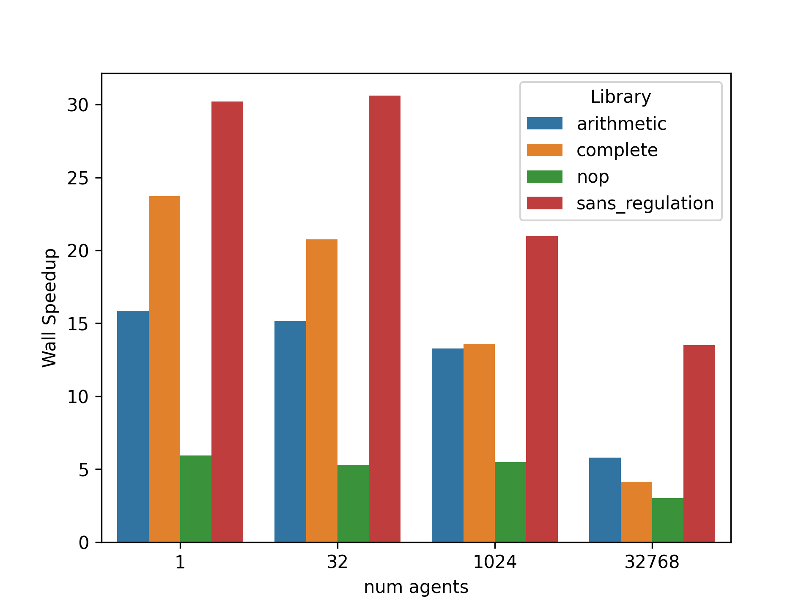
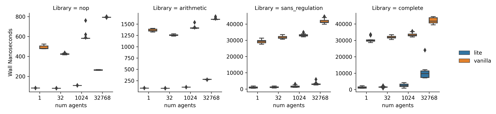

# signalgp-lite

[](https://github.com/mmore500/signalgp-lite/releases)
[](https://www.codacy.com/gh/mmore500/signalgp-lite/dashboard?utm_source=github.com&amp;utm_medium=referral&amp;utm_content=mmore500/signalgp-lite&amp;utm_campaign=Badge_Grade)
[](https://github.com/mmore500/signalgp-lite/actions?query=workflow%3ACI)
[](https://signalgp-lite.readthedocs.io/en/latest/?badge=latest)
[](https://signalgp-lite.readthedocs.io/en/latest/)
[](https://codecov.io/gh/mmore500/signalgp-lite)
[](https://github.com/mmore500/signalgp-lite/search?q=todo+OR+fixme&type=)
[](https://github.com/mmore500/signalgp-lite)

<!-- Check out the live in-browser web app at <https://mmore500.github.io/signalgp-lite>. -->

-   Free software: MIT license
-   Documentation: <https://signalgp-lite.readthedocs.io>
-   header-only, namespace-encapsulated software

A genetic programming implementation designed for large-scale artificial life applications.
Organized as a header-only C++ library.
Inspired by [Alex Lalejini](http://lalejini.com/)'s [SignalGP](https://github.com/amlalejini/signalgp).

## Quick Start

This "hello world" example throws together
* a custom hardware peripheral to manage greeting information,
* a custom operation to print a greeting, and
* generation of a random program,
* execution of that random program on a virtual multi-core CPU.

`say-hello.cpp`:
```cpp
#include <iostream>
#include <ratio>
#include <string>

#include "Empirical/include/emp/math/Random.hpp"

#include "sgpl/algorithm/execute_cpu.hpp"
#include "sgpl/spec/Spec.hpp"
#include "sgpl/hardware/Cpu.hpp"
#include "sgpl/library/OpLibraryCoupler.hpp"
#include "sgpl/library/prefab/ControlFlowOpLibrary.hpp"
#include "sgpl/program/Program.hpp"

emp::Random rng;

// custom hardware peripheral, can be written to or read from during execution
struct Peripheral {
  size_t greet_count{};
  std::string name;
};

// custom CPU operation
struct SayHello {

  template<typename Spec>
  static void run(
    sgpl::Core<Spec>&,
    const sgpl::Instruction<Spec>&,
    const sgpl::Program<Spec>&,
    typename Spec::peripheral_t& peripheral
  ) {
    std::cout << "for the " << peripheral.greet_count++ << "th time... ";
    std::cout << "hello there " << peripheral.name << '\n';
  }

  static std::string name() { return "SayHello"; }

  static size_t prevalence() { return 1; }

};

// extends prefab ControlFlowOpLibrary with SayHello operation
using library_t = sgpl::OpLibraryCoupler<sgpl::ControlFlowOpLibrary, SayHello>;

// custom compile-time configurator type
using spec_t = sgpl::Spec<library_t, Peripheral>;

int main() {

  sgpl::Cpu<spec_t> cpu;
  Peripheral peripheral;
  peripheral.name = "Grace Hopper";

  sgpl::Program<spec_t> program{ 100 }; // randomly generated, 100 instructions

  cpu.InitializeAnchors( program ); // load program onto CPU

  // generate random signals to launch available virtual cores
  while ( cpu.TryLaunchCore( emp::BitSet<64>(rng) ) ) ;

  // execute up to one thousand instructions
  sgpl::execute_cpu<spec_t>( std::kilo::num, cpu, program, peripheral );

}
```

compile:
```bash
g++ --std=c++17 -Iinclude/ -Ithird-party/ say-hello.cpp -o say-hello.out
```

run:
```bash
./say-hello.out
```

## Benchmarks

signalgp-lite provides several-times speedup over the current "vanilla" SignalGP implementation.

[](https://osf.io/2pdur/)
*[Speedup](https://en.wikipedia.org/wiki/Speedup) of mean instruction execution time provided by signalgp-lite compared to vanilla SignalGP.
Speedup is measured for random programs generated from different subsets of instructions ("libraries") over different-size populations of virtual CPUs ("num agents").*

For randomly-generated programs composed of arbitrary instructions, signalgp-lite approaches a virtual instruction execution rate of around 10Mhz on a 3.5Ghz processor.
Virtual nop instructions execute at rate of around 200Mhz.

[](https://osf.io/6te73/)
*[Wall clock](https://en.wikipedia.org/wiki/Elapsed_real_time) timings of twenty randomly-generated programs composed of instructions from different libraries.*

Timings for `nop` and `arithmetic` libraries report the mean time to execute sixteen instructions on one core.
Timings for `complete` and `sans_regulation` libraries report timings for executing sixteen instructions, one each across sixteen virtual threads.
(`sans_regulation` refers to the `complete` library with tag-matching regulation disabled.)

These results are associated with [commit c10ed70](https://github.com/mmore500/signalgp-lite/commit/c10ed70), measured at 1602292830 seconds since epoch.
Details on the machine used to perform these benchmarks are available via [Open Science Framework](https://osf.io/), e.g., <https://osf.io/hu8m2/>.
[mimalloc](https://github.com/microsoft/mimalloc) memory allocator.

Microbenchmarks are performed, graphed, and uploaded as part of the project's CI build, so check the [project's OSF page](https://osf.io/j8pge/) for up-to-the-minute profiling information!

## Credits

This library draws heavily on Alex Lalejini's work with SignalGP.

This package was created with [Cookiecutter](https://github.com/audreyr/cookiecutter) and the [devosoft/cookiecutter-empirical-project](https://github.com/devosoft/cookiecutter-empirical-project) project template.

This package uses [Empirical](https://github.com/devosoft/Empirical#readme), a library of tools for scientific software development, with emphasis on also being able to build web interfaces using [Emscripten](https://emscripten.org/).
