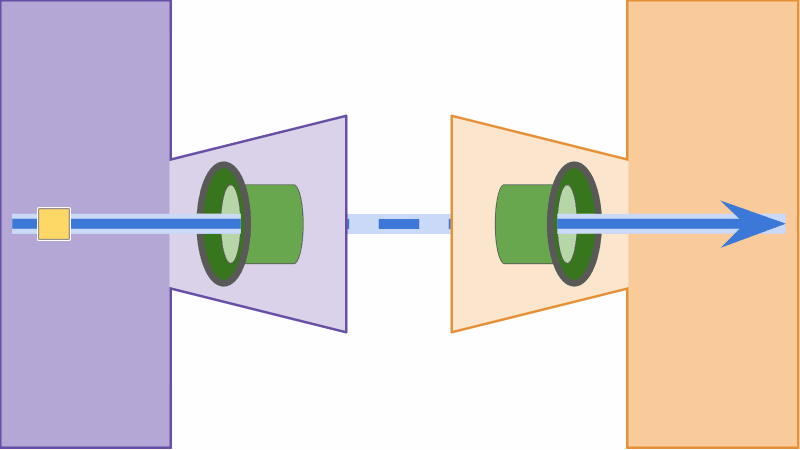
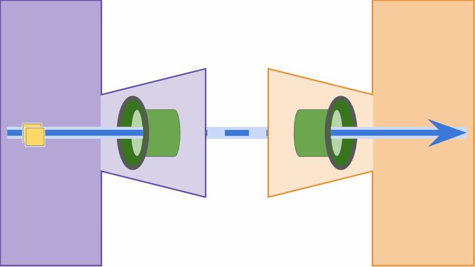
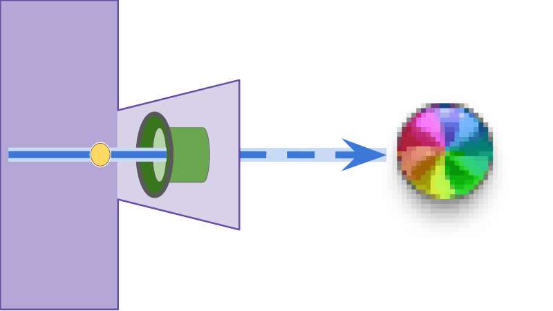
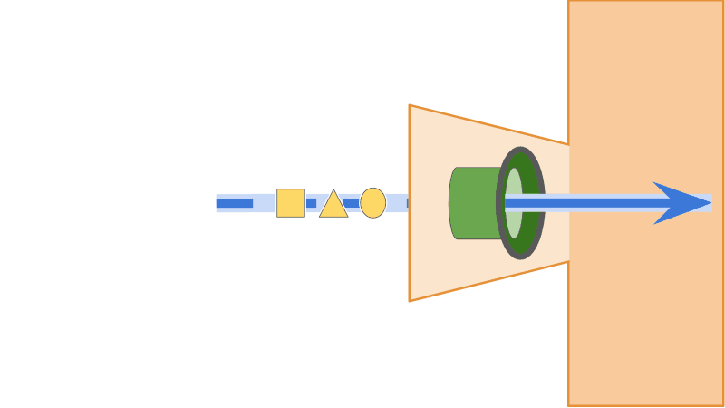
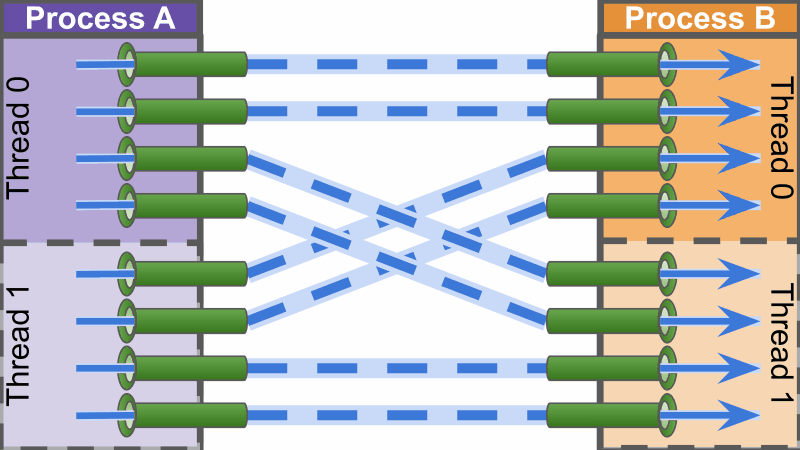
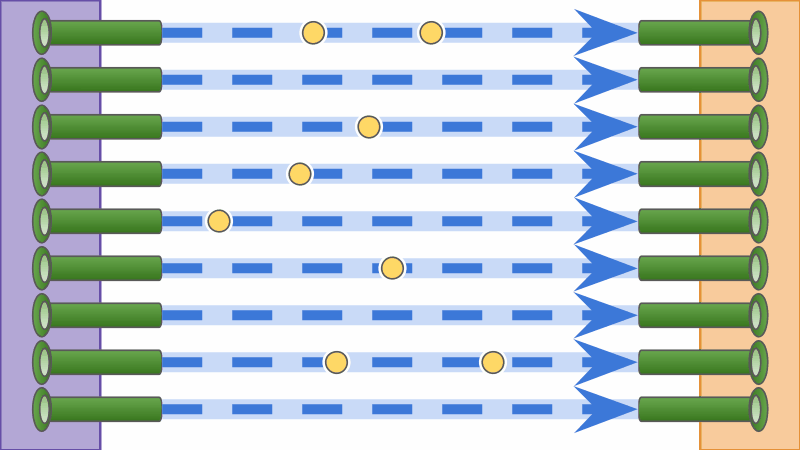
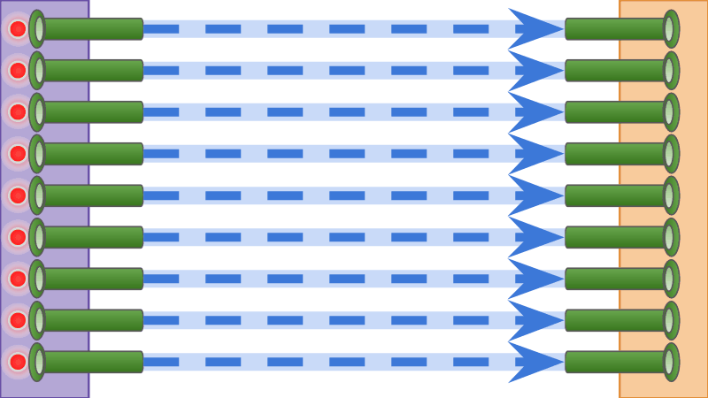
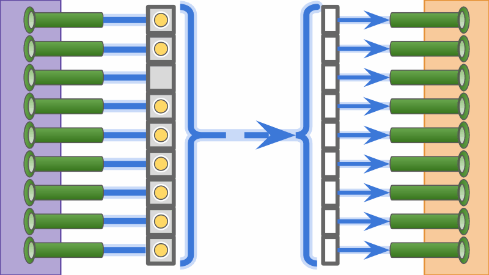
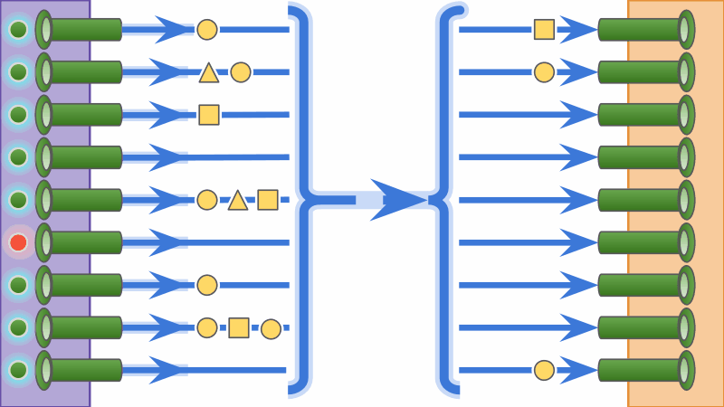

[](https://github.com/mmore500/conduit/releases)
[](https://app.codacy.com/manual/mmore500/conduit?utm_source=github.com&utm_medium=referral&utm_content=mmore500/conduit&utm_campaign=Badge_Grade_Dashboard)
[](https://github.com/mmore500/conduit/actions?query=workflow%3ACI)
[](https://uit.readthedocs.io/en/latest/?badge=latest)
[](https://uit.readthedocs.io/en/latest/)
[](https://codecov.io/gh/mmore500/conduit)
[](https://hub.docker.com/r/mmore500/conduit)
[](https://github.com/XAMPPRocky/tokei)
[](https://github.com/XAMPPRocky/tokei)
[](https://github.com/mmore500/conduit/search?q=todo+OR+fixme&type=)
[](https://github.com/mmore500/conduit)
[](https://zenodo.org/badge/latestdoi/278400174)

  * Free software: MIT license
  * Documentation: [https://conduit.fyi](https://conduit.fyi)
  * header-only, namespace-encapsulated software

C++ library that wraps intra-thread, inter-thread, and inter-process communication in a uniform, modular, object-oriented interface, with a focus on asynchronous high-performance computing applications.

## Design

The driving objective behind this library is to provide a performant, uniform, convenient interface for communication between simulation elements, whether those simulation elements reside on the same thread, different threads, or entirely different processes.


The conduit model consists of:
  * `Inlet`'s, which accepts inputs `T` through a non-blocking call,
  * `Duct`'s, which handle transmission logistics,
  * `Outlet`'s, which provides the latest `T` or next `T` through a non-blocking call.

`Inlet` and `Outlet` objects both hold a [`std::shared_ptr`](https://en.cppreference.com/w/cpp/memory/shared_ptr) to a `Duct` object.
The `Duct` object is implemented as a [`std::variant`](https://en.cppreference.com/w/cpp/utility/variant) of three implementation types:
  * `IntraDuct` type for intra-thread communication (default),
  * `ThreadDuct` type one for inter-thread communication, and
  * `ProcDuct` type for inter-process communication.

The `Duct`'s active implementation can be switched at run-time by calling `EmplaceDuct<Type>` from either the `Inlet` or the `Outlet`.
All calls to a `Duct` at run-time are forwarded to its active implementation.
For example, emplacing a `ThreadDuct` might yield the following.


Calling `SplitDuct<Type>` from either the `Inlet` or the `Outlet` will drop the callee's `std::shared_ptr` to the existing `Duct` in favor of a `std::shared_ptr` to a newly-constructed `Duct` with the specified implementation type active.
(This operation is useful for inter-process communication, where coupled `Inlet` and `Outlet`'s do not reside in a common memory space).
For example, calling `SplitDuct<ProcDuct>` on an `Inlet` might yield the following.


`Inlet` and `Outlet` are entirely interchangeable no matter the current `Duct` implementation is active.
Once a `Duct`'s are configured, `Inlet` and `Outlet` objects can be without any concern for underlying implementation.
This abstraction ensures a uniform API whether underlying communication is intra-thread, inter-thread, or inter-process.
Furthermore, a `Duct` implementation can be re-configured or even re-directed at run time without any interaction with an `Inlet` or `Outlet` its tied to.

## Low-Level Interface: `uit`

Conduit provides three helper construction interfaces:
  * `Conduit`, which constructs an `Inlet` and `Outlet` with a shared `Duct`,
  * `Sink`, which constructs an `Inlet` with sole holdership of a `Duct`,
  * `Source`, which constructs an `Outlet` with sole holdership of a `Duct`.


After constructing a `Conduit`, `Sink`, or `Source`, users can use [structured binding](https://en.cppreference.com/w/cpp/language/structured_binding) or an accessor method to retrieve `Inlet`'s or `Outlet`'s.

Here's an example of how this works in code.

`conduit/low.cpp`:
```cpp
#include <iostream>
#include <ratio>
#include <utility>

#include "uit/fixtures/Conduit.hpp"
#include "uitsl/parallel/ThreadTeam.hpp"
#include "uit/setup/ImplSpec.hpp"

// use int as message type
using Spec = uit::ImplSpec<int>;

int main() {

  // construct conduit with thread-safe implementation active
  uit::Conduit<Spec> conduit{
    std::in_place_type_t<Spec::ThreadDuct>{}
  };

  auto& [inlet, outlet] = conduit;

  uitsl::ThreadTeam team;

  // start a producer thread
  team.Add( [&inlet](){
    for (int i = 0; i < std::mega::num; ++i) inlet.TryPut(i);
  } );

  // start a consumer thread
  team.Add( [&outlet](){
    int prev{ outlet.JumpGet() };
    size_t update_counter{};
    for (size_t i = 0; i < std::mega::num; ++i) {
      update_counter += std::exchange(prev, outlet.JumpGet()) == prev;
    }
    std::cout << update_counter << " updates detected" << '\n';
  } );

  // wait for threads to complete
  team.Join();

  return 0;

}
```

Navigate to the `conduit` directory.
Then, to compile and run,
```sh
mpicxx --std=c++17 -O3 -DNDEBUG -Iinclude/ low.cpp -lpthread
./a.out
```

:bangbang:
You'll need an MPI compiler and runtime library for the code examples here.
If you don't have those on hand, grab a copy of our pre-built Docker container and hop inside there.
```sh
sudo docker run -it mmore500/conduit:latest
```

If you're on a cluster without root access, you can try using Singularity.
```sh
singularity shell docker://mmore500/conduit
```

## High-Level Interface: `uitnet`

The conduit library provides a `Mesh` interface to streamline construction of complex, potentially irregular, conduit networks.
These networks are conceived as a directed graph, with edges representing conduits and nodes representing an actor that holds a set of `Inlet`'s and/or `Outlet`'s.

`Mesh`es are constructed through two independently-specified components,
 1. topology: how should nodes be connected?
 2. delegation: how should nodes be assigned to threads and processes?

Here's an example topology, with each node connected to a successor in a one-dimensional ring.


We might choose to delegate contiguous subsets of nodes to threads and processes.
For example, to distribute 24 nodes over four double-threaded processes, we might perform the following assignment:
  * node 0 :arrow_right: thread 0, process 0
  * node 1 :arrow_right: thread 0, process 0
  * node 2 :arrow_right: thread 0, process 0
  * node 3 :arrow_right: thread 1, process 0
  * node 4 :arrow_right: thread 1, process 0
  * node 5 :arrow_right: thread 1, process 0
  * node 6 :arrow_right: thread 0, process 1
  * node 7 :arrow_right: thread 0, process 1
  * node 8 :arrow_right: thread 0, process 1
  * node 9 :arrow_right: thread 1, process 1
  * etc.


Arbitrary topologies can be specified, with pre-built factories available to construct the most common configurations.
For example, a two-dimensional lattice grid,


We can use a specialized delegation function to distribute nodes.


When a `Mesh` is constructed from a topology and a delegation function, edges between nodes are instantiated in terms of `Inlet`'s and `Outlet`'s.
During `Mesh` construction, thread-safe `Duct` implementations are emplaced on conduits that span between nodes assigned to different threads and inter-process `Duct` implementations are emplaced on conduits that span between nodes assigned to different proceses.

Once the `Mesh` is constructed, `GetSubmesh()` returns the network components that are assigned to a particular thread or process.


The `GetSubmesh()` call returns an `emp::vector` of `MeshNode`'s.
Each `MeshNode` consists of an "input" vector of `Outlet`'s and an "output" vector of `Inlet`'s.


Here's what the entire process looks like in code.

`conduit/high.cpp`:
```cpp
#include <iostream>
#include <tuple>
#include <sstream>

#include "uitsl/mpi/MpiGuard.hpp"
#include "uitsl/parallel/ThreadTeam.hpp"

#include "uit/setup/ImplSpec.hpp"

#include "netuit/arrange/RingTopologyFactory.hpp"
#include "netuit/mesh/Mesh.hpp"

const size_t num_nodes = 5; // five nodes in our topology
const size_t num_procs = 2; // two MPI processes
const size_t num_threads = 2; // two threads per process

// message to pass through the conduits
// contains information about node, thread, and process of sender
struct Message {

  size_t node_id{};
  uitsl::thread_id_t thread_id{};
  uitsl::proc_id_t proc_id{};

  bool operator==(const Message& other) const {
    return std::tuple{
      node_id,
      thread_id,
      proc_id
    } == std::tuple{
      other.node_id,
      other.thread_id,
      other.proc_id
    };
  }

  std::string ToString() const {

    std::stringstream ss;
    ss << "p" << uitsl::get_proc_id();
    ss << " / ";
    ss << "t" << thread_id;
    ss << " / ";
    ss << "n" << node_id;

    return ss.str();

  }

};

// transmit Message through conduits with default duct implementations
using Spec = uit::ImplSpec<Message>;

// MPI initialization & finalization boilerplate
const uitsl::MpiGuard guard;

// first task each thread will execute
void send_task(
  const uitsl::thread_id_t thread_id,
  netuit::Mesh<Spec>::submesh_t& my_nodes
) {

  // goal: for each output in each node, send a message with info about the
  // sending node, thread, and process so we can check how things are connected
  for (size_t node_id = 0; node_id < my_nodes.size(); ++node_id) {

    const Message message{ node_id, thread_id, uitsl::get_proc_id() };

    auto& node = my_nodes[node_id];

    // send message
    for (auto& output : node.GetOutputs()) output.Put( message );

  }

}

// second task each thread will execute
void receive_task(
  const uitsl::thread_id_t thread_id,
  netuit::Mesh<Spec>::submesh_t& my_nodes
) {

  // goal: for each input to each node, print out info about who received what
  // message
  for (size_t node_id = 0; node_id < my_nodes.size(); ++node_id) {

    // for convenience of printing who I am
    const Message my_info{ node_id, thread_id, uitsl::get_proc_id() };

    auto& node = my_nodes[node_id];

    for (auto& input : node.GetInputs()) {
      const Message received{ input.GetNext() };
      std::cout << received.ToString() << "  =>  " << my_info.ToString()
        << '\n';
    }
  }

}

// make each thread execute send_task then receive_&ask
void thread_job(const uitsl::thread_id_t thread_id, netuit::Mesh<Spec>& mesh) {

  // get nodes that this thread on this process are responsible for
  auto my_nodes = mesh.GetSubmesh(thread_id);

  send_task(thread_id, my_nodes);
  receive_task(thread_id, my_nodes);

}

int main() {

  // instantiate a network of conduits
  netuit::Mesh<Spec> mesh{
    // how should nodes be connected?
    netuit::RingTopologyFactory{}(num_nodes),
    // how should nodes be assigned to threads?
    uitsl::AssignRoundRobin<uitsl::thread_id_t>{num_threads},
    // how should nodes be assigned to processes?
    uitsl::AssignContiguously<uitsl::proc_id_t>{num_procs, num_nodes}
  };

  // kick off threads
  uitsl::ThreadTeam team;
  for (uitsl::thread_id_t tid = 0; tid < num_threads; ++tid) {
    team.Add([tid, &mesh](){ thread_job(tid, mesh); });
  }

  // wait for threads to complete
  team.Join();

  return 0;

}
```

Now compile and run.

```sh
mpicxx --std=c++17 -O3 -DNDEBUG -Iinclude/ high.cpp -lpthread
script/uitexec -n 2 script/uitwrap ./a.out | cat
```

## Modular Duct Implementations

The Duct implementations used for intra-thread, inter-thread, or inter-process communication can be swapped at compile time.
Desired implementations should be specified through the `ImplSelect` type.
Here's an example.

`swipswap.cpp`:
```cpp
#include <string>

#include "cereal/include/cereal/types/string.hpp"

#include "uit/ducts/intra/put=dropping+get=stepping+type=any/a::SerialPendingDuct.hpp"
#include "uit/ducts/proc/put=dropping+get=stepping+type=cereal/inlet=RingIsend+outlet=Iprobe_c::IriOiDuct.hpp"
#include "uit/ducts/thread/put=dropping+get=stepping+type=any/a::RigtorpDuct.hpp"
#include "uit/setup/ImplSelect.hpp"
#include "uit/setup/ImplSpec.hpp"

#include "netuit/arrange/RingTopologyFactory.hpp"
#include "netuit/mesh/Mesh.hpp"

constexpr size_t num_nodes = 4;

using Message = std::string;

using ImplSel = uit::ImplSelect<
  uit::a::SerialPendingDuct, // specifies IntraDuct
  uit::a::RigtorpDuct, // specifies ThreadDuct
  uit::c::IriOiDuct // specifies ProcDuct
>;

using ImplSpec = uit::ImplSpec<
  Message, // specifies message type
  ImplSel // specifies impls to use for intra, thread, proc communication
>;

int main() {

  netuit::Mesh<ImplSpec> mesh{
    // how should nodes be connected?
    netuit::RingTopologyFactory{}(num_nodes),
    // how should nodes be assigned to threads?
    uitsl::AssignSegregated<uitsl::thread_id_t>{},
    // how should nodes be assigned to processes?
    uitsl::AssignSegregated<uitsl::proc_id_t>{}
  };

  // etc...

  return 0;

}

```

```sh
mpicxx --std=c++17 -Iinclude/ -Ithird-party/ swipswap.cpp -lpthread
script/uitexec -n 2 script/uitwrap ./a.out | cat
```

Because implementation is specified through type instances instead of globally, multiple implementations may be used within the same executable.

## Duct Categories

In the `include/uit/ducts/` directory, duct implementations are categorized by the communication context they're designed for:
  * intra-thread communication ("`intra/`"),
  * inter-thread communication ("`thread/`"), and
  * inter-process communication ("`proc/`").

A fourth category, "`mock`", provides non-functional implementations meant for testing or situations compiling multithread or multiprocess code isn't feasible.

## Message Type

Implementations are templated on message type, allowing nearly any type to be sent as a message.
However, not all implementations are compatible with all types.
Implementations are organized and subnamespaced using the following type-compatibility designators.

  * "any" (subnamespace `a`)
    * any type with a move or copy constructor
  * "cereal" (subnamespace `c`)
    * any type compatible with the [cereal C++ serialization library](https://github.com/USCiLab/cereal)
    * cereal has great support for standard library containers!
    * custom types can be easily be made serializable with cereal by writing some boilerplate member functions
  * "fundamental" (subnamespace `f`)
    * nominally, [fundamental types](https://en.cppreference.com/w/cpp/language/types)
    * basically, [arithmetic types](https://en.cppreference.com/w/c/language/arithmetic_types)
  * "span" (subnamespace `s`)
    * class with `.data()`, `.size()`, `::value_type` members
    * size can be dynamic or fixed at runtime when a duct is created
  * ["trivially copyable"](https://en.cppreference.com/w/cpp/types/is_trivially_copyable) (subnamespace `t`)
    * basically, objects that can be safely copied with [std:memcpy](https://en.cppreference.com/w/cpp/string/byte/memcpy)

Proper use is `static_assert`'ed at compile time.

## Word Ducts vs. Accumulating Ducts

In addition to word ducts, which deliver individual messages, conduit also provides accumulating ducts, which may perform an operation (for example, addition) to consolidate messages traveling through the same duct.
These ducts are useful for modeling, for example, the transfer of a continuously-valued quantity.


*Animation of word behavior, where any message that is received corresponds to an identical sent message.*


*Animation of accumulating behavior, where received messages may constitute an amalgamation of several sent messages.*

`TryStep` or `GetNext` may not be called on accumulating ducts.
Calling `Jump` or `JumpGet` on an accumulating duct will reset the accumulating quantity.
Calling `Get` allows the accumulating quantity to be observed without being reset.

## Word Ducts: Growing vs. Dropping

Word ducts may exhibit one of two behaviors with respect to put operations: dropping or growing.

For a "growing" duct, no put call on that duct will block or reject the incoming message.


*Animation of growing behavior, where puts are always accommodated.*

For a "dropping" duct, a put call may block or reject an incoming message i.e., if its send buffer is full.


*Animation of growing behavior, where puts may be rejected.*

## Word Ducts: Skipping vs. Stepping

Word ducts may have one of two capacities with respect to get operations: skipping or stepping.

For a "stepping" duct, received messages may be retrieved one-by-one.


*Animation of stepping get capability, where received messages can be requested one-by-one.*

For a "skipping" duct, only the most-recently received message can be retrieved.
Calling `GetNext` or `TryStep` (instead of `JumpGet` or `Jump`) on a skipping duct will throw an assert (in debug mode).


*Animation of skipping get capability, where only most-recently received messages are available.*

## Consolidation

Inter-process messages may incur significant overhead in terms of processing time and message size, especially for small messages.
So, consolidating many small messages sent between pairs of processes into fewer larger messages can pay off as a big performance win.

Conduit provides duct implementations that can perform different types of consolidation.
To reduce thread synchronization overhead and prevent threads from needing to run in lockstep, implementations only consolidate messages between ducts within a particular thread that are headed to another particular thread and process (not between all sets of threads on two processes).
(If inter-thread consolidation makes sense for your use case, though, writing an extension implementation would be feasible.)


*Comparison of unconsolidated and consolidated interprocess messaging.*

Under the hood, consolidation among ducts is accomplished by a shared back-end, managed via `shared_ptr`.
This design allows for multiple independent sets of consolidated ducts to be instantiated concurrently.
The high-level `netuit` interface takes care of initializing and cleaning up the shared back-end automatically.

## Unconsolidated

Without consolidation, each duct would send independent inter-process messages between all pairs of connected inlets and outlets.


*Animation of unconsolidated inter-process ducts.*

## Buffered

Buffered ducts consolidate messages on an inlet-by-inlet basis.
When `TryFlush()` is called on a duct, its pending inter-process messages are consolidated and sent as a single message.


*Animation of buffered inter-process ducts.*

## Pooled

Pooled ducts expect one contribution to be provided from each constituent duct in a round-robin fashion.
This potentially allows for fixed-length interprocess messages to be used under the hood.
The pooled message is automatically sent immediately all constituent ducts have contributed.


*Animation of pooled inter-process ducts.*

## Aggregated

Aggregated ducts allow an arbitrary number of message contributions --- zero or more --- to be made from each duct.
Once each duct has called `TryFlush()`, all pending inter-process messages are consolidated and sent as a single message.
This operation preserves the ordering of messages sent from the same inlet.


*Animation of aggregated inter-process ducts.*

## Extensibility

  * Create your own topologies by writing a topology-generating method or loading a topology from file, perhaps generated via another tool like [NetworkX](https://networkx.github.io/documentation/stable/reference/readwrite/adjlist.html).
  * Define your own delegation functor to control how nodes are distributed between threads and processes.
  * Seamlessly write and build with your own intra-thread, inter-thread, or inter-process duct implementations.

Implementations of inter-process communication currently use the [Messgage Passing Interface (MPI)](https://www.mpi-forum.org/docs/) standard.

## Benchmarks

Benchmarks are performed during Travis builds and occasionally on the [iCER HPCC cluster](https://icer.msu.edu/).
Benchmark results are available at [https://osf.io/7jkgp/](https://osf.io/7jkgp/).

## Organization

Code is organized into three hierarchically-leveized namespaces.

Base-level utility code resides in the `uitsl` ("conduit support library") namespace.
Although tools in this namespace may be useful outside the scope of the conduit project, no conduit API is written in this namespace.

The low-level API resides in the `uit` ("conduit") namespace.
The high-level API resides in the `netuit` ("networked conduit") namespace.

## Acknowledgement

This project is built using the [Empirical C++ library](https://github.com/devosoft/Empirical/).

This project is developed in support of the [DISHTINY](https://mmore500.com/dishtiny) digital multicellularity evolution project.

This package was created with [Cookiecutter](https://github.com/audreyr/cookiecutter) and the [devosoft/cookiecutter-empirical-project](https://github.com/devosoft/cookiecutter-empirical-project) project template.

This research was supported in part by NSF grants DEB-1655715 and DBI-0939454.
This material is based upon work supported by the National Science Foundation Graduate Research Fellowship under Grant No. DGE-1424871.
Any opinions, findings, and conclusions or recommendations expressed in this material are those of the author(s) and do not necessarily reflect the views of the National Science Foundation.

Michigan State University provided computational resources used in this work through the [Institute for Cyber-Enabled Research](https://icer.msu.edu/).

This research is conducted in affiliation with the [Digital Evolution Laboratory](https://devolab.org/) at Michigan State University, the [BEACON Center for the Study of Evolution in Action](https://www3.beacon-center.org/), the [Ecology, Evolutionary Biology, and Behavior](https://eebb.natsci.msu.edu/) Program at MSU, and the [Department of Computer Science and Engineering](http://cse.msu.edu/) at MSU.
